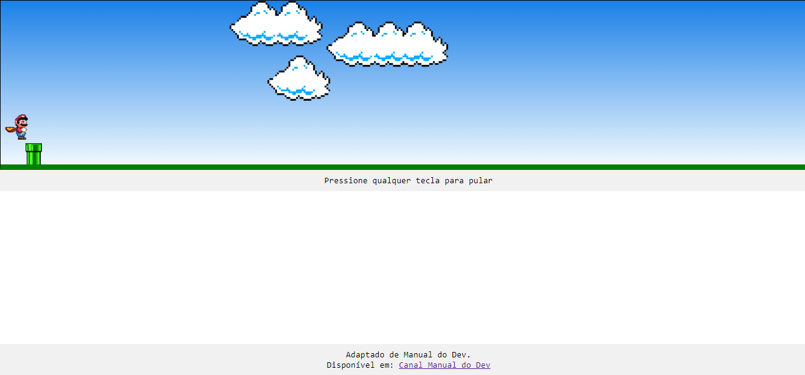
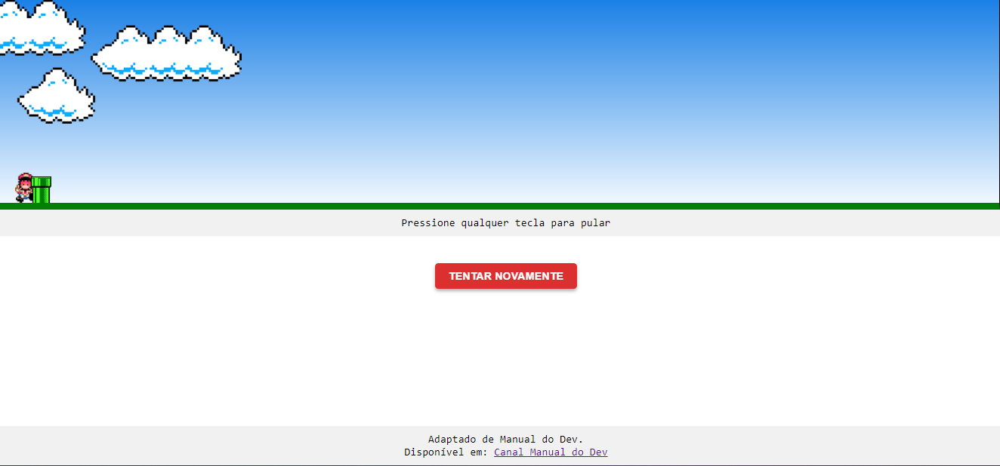

# Mario Jump

## MiniGame feito com HTML, CSS e JavaScript onde o mario pular por cima dos canos.
versão 1.0

## Jogando

## Game Over

---

## Planos para a próxima versão
* Adicionar pontuação do jogador
* Adicionar recorde de pontuação
* Adicionar mais nuvens
--- 

## Créditos
 Adaptado de [Canal Manual do Dev](https://www.youtube.com/watch?v=r9buAwVBDhA)

